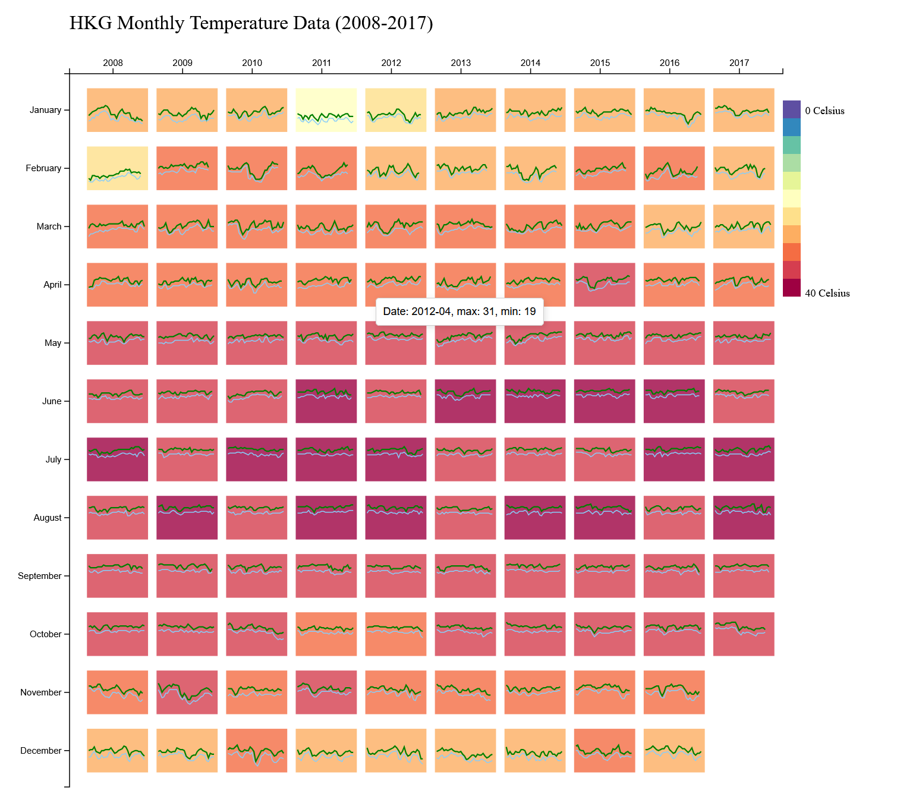

# CSCE 679 Data Visualization Assignment 1

**Matrix View** to visualize the **Monthly Temperature** of Hong Kong (2008-2017), where the color of each matrix cell encodes the temperature. The data is found in [temperature_daily.csv](./temperature_daily.csv). You only need to focus on the last 10 years of data.

1. In the matrix, the x direction indicates the year, and the y direction indicates the month. Each cell indicates the corresponding month of a specific year.

1. Maximum and minimum temperatures visualized by month using the background color of each cell. Mouse click is used to switch between the maximum and minimum temperatures.

1. When hovering the mouse on each cell, a tip appears to show the date and the temperature value.

1. Mini line chart in each cell shows daily temperature changes. The x-axis represents the days in a month, and the y-axis represents the temperature.

1. Legend shows the mapping between colors and values.

Preview:

